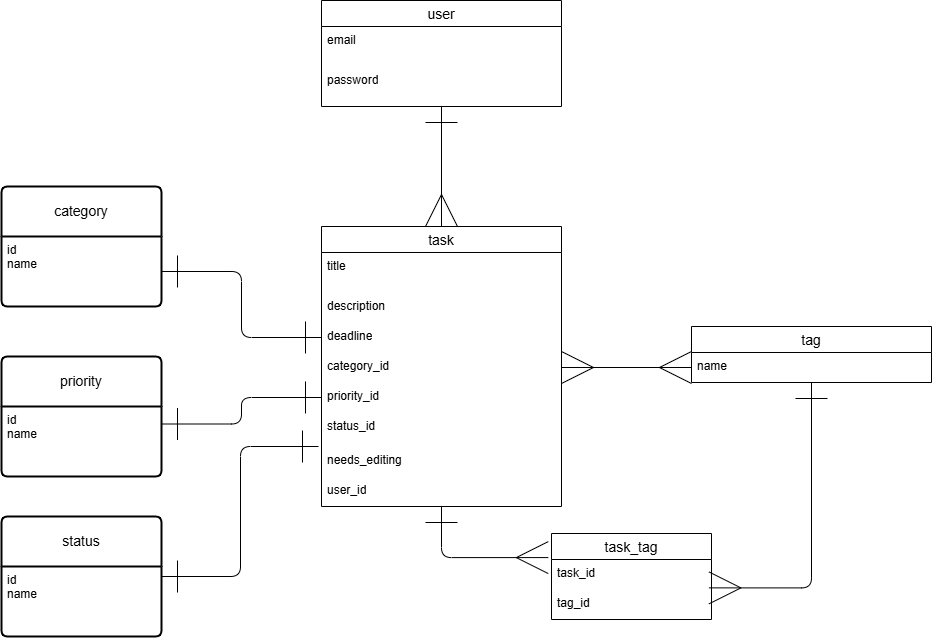
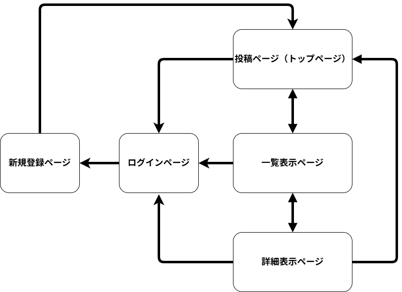

# アプリケーション名
おきタスノート

# アプリケーション概要
メモをする感覚で投稿可能なtodoアプリ

# URL
https://todomemo-45757.onrender.com

# テスト用アカウント
- Basic認証ID : yomin
- Basic認証パスワード : 1375

# 利用方法
1. アプリにログインする
2. タスクを投稿する
3. タスクを確認・編集・削除する

# アプリケーションを作成した背景
私がメモをする時間がない、それらを管理アプリに移す作業の時間を短縮したいという課題を持っていて、同様の課題を解決したい人が多いのではないかと考えた。ワンボタンで投稿でき、内容につながるフックが保存される機能を持ったtodoアプリを作成することで、課題を改善することが可能だと思い、このアプリを開発した。

# 実装した機能についての画像やGIFおよびその説明

# 実装予定の機能
- タグ機能  
- タスク並べ替え機能  
- タスクフィルター機能  
- タスク検索機能

# データベース設計
- 角丸はアクティブハッシュ

# 画面遷移図

# 開発環境
- **Ruby** : 3.2.0
- **Rails** : 7.1.5.1
- **データベース**
  - 開発・テスト環境 : MySQL 8.x (adapter: mysql)
    - 開発DB: `todomemo_45757_development`
    - テストDB: `todomemo_45757_test`
  - 本番環境: PostgreSQL（DATABASE_URL 経由）
- **JavaScript / フロントエンド**
  - Node.js（バージョン確認推奨）
  - npm（バージョン確認推奨）
  - Tailwind CSS、Turbo Rails、Stimulus
- **主要Gem / ライブラリ**
  - devise, factory_bot_rails, faker
  - rspec-rails, rubocop, selenium-webdriver
  - bootsnap, sprockets-rails, importmap-rails
- **Bundler** : 2.4.1
- **OS**: Linux x86_64（開発環境に応じて macOS / Windows も可）
# ローカルでの動作方法
以下のコマンドを順に実行。  
% git clone https://github.com/yominmirin/todomemo-45757  
% cd todomemo-45757  
% bundle install  
% rails db:create  
% rails db:migrate
# 工夫したポイント
- 投稿後に投稿ページに戻る点

- 投稿時に投稿数で投稿成功がわかるようにした点

- 編集中に編集前の内容が表示されるよう設計した点